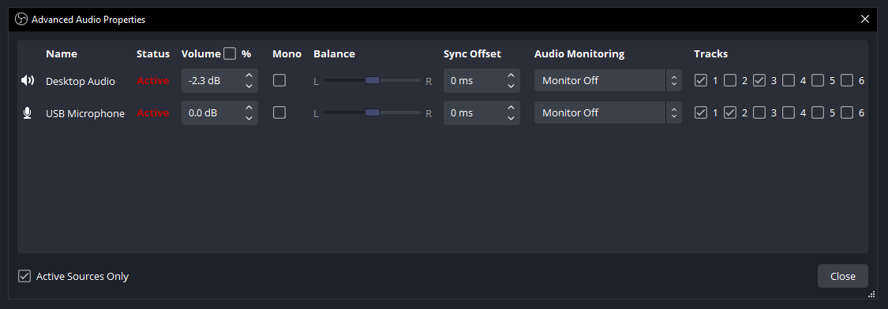
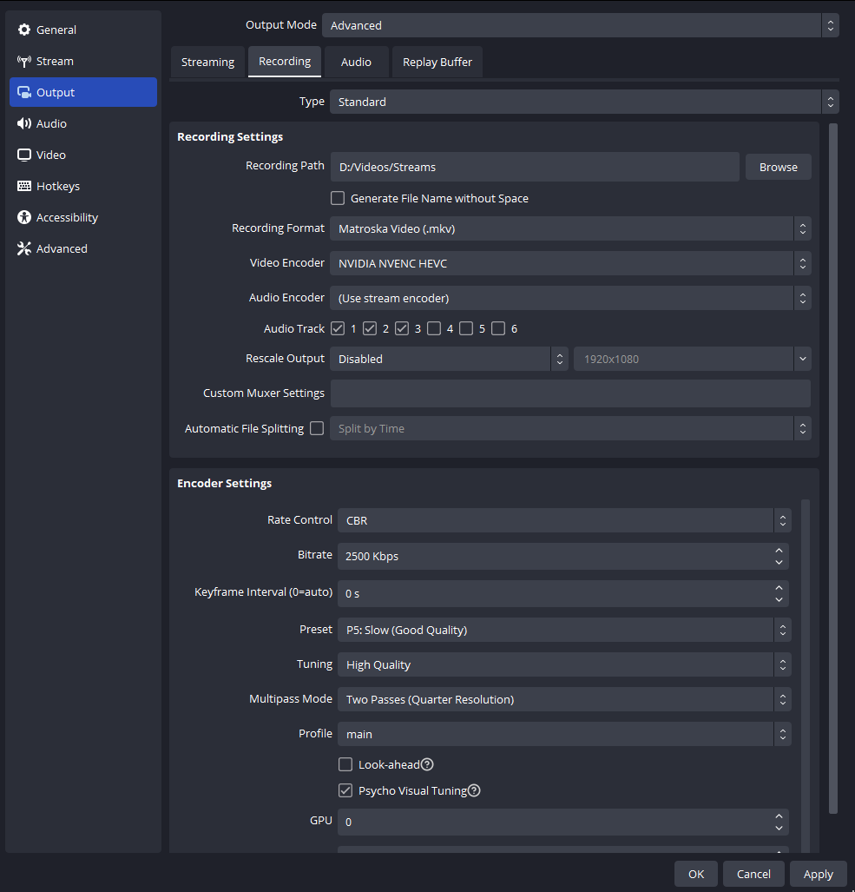

# Parley

[](https://github.com/gruz0/parley/actions/workflows/ci.yml)
[](LICENSE)

> **Private, speaker-labeled transcripts of any multi-speaker recording — 100% local, on your GPU.**\
> no cloud · no subscriptions · no OBS → Premiere → ChatGPT

```
$ make transcribe FILE="call.mp4"
>> Done. transcripts/call/

[Alex]:  So what's the current valuation you're raising at?
[Sam]:   We're raising at a 12 pre, and we've already got soft commits for half the round.
[Alex]:  Got it. And what does the cap table look like today?
```

> **Parley is developers-first** — it's a handful of command-line scripts. If you're comfortable in a
> terminal, you'll be up and running in ~20 minutes. **Not a developer?** I'm happy to help you (or your
> whole organization) get it set up — just email me at **kadyrov.dev@gmail.com**.

---

## Hey, it's Alex 👋

For the last **2 years** I've been recording founder and investor calls — a few every week, usually two or three people on the line. Recently I started raising for one of my startups, and those recordings suddenly became gold: the objection an investor raised in minute 43, the exact number a founder quoted, the thing I promised to follow up on.

The problem was always the same: **how do I get a specific part of an hour-long recording back out**, in text, so I can actually work with it — without shipping my confidential calls off to some cloud service?

My old workflow was a mess:

1. Record in **OBS**
2. Open **Adobe Premiere** to get captions
3. Burn them, export an SRT — one giant wall of text with **no idea who said what**
4. Paste it into **ChatGPT/Claude** and hope for the best

Three apps, a paid subscription or two, and I _still_ couldn't tell the founder from the investor in the transcript.

So — as a vibe coder — I built myself a tiny setup to kill all of that. Meet **Parley**.

One command turns a raw recording into a clean, **speaker-labeled** transcript, entirely on my own machine. No cloud. No subscription. No Premiere.

## Why not just use a meeting bot?

You know the ones — the assistants that join your Zoom / Google Meet / Teams call and email you a summary afterward. I tried them. I got tired of them, because:

- **They decide what mattered.** You get _their_ summary, and the one line you actually needed got compressed away.
- **They miss things.** Cross-talk, accents, a quiet second speaker — important parts just vanish.
- **They're a privacy question mark.** Fundraising conversations are sensitive. I don't want them sitting on someone else's servers.
- **They cost money**, monthly, forever.

Parley does the opposite. It gives you the **full, word-for-word transcript with speakers labeled** — no AI deciding what's important — and then _you_ bring your own AI to it. Which brings us to the fun part.

## The real workflow: chat with your calls

The transcript is just plain text, so you can drop it into whatever AI tool you already use and actually _talk to your call_:

- **Claude Code / Claude / ChatGPT** — paste or attach the `.txt` and ask real questions:
  > "What were the three main objections the investor raised, and how did I respond to each?"
  > "List every metric or number mentioned, with who said it."
  > "Draft a follow-up email addressing their concerns about our burn rate."
- **NotebookLM** — add the transcript as a source, then ask questions across _all_ your calls at once, or generate an audio overview.
- **Just grep it** — it's text on your disk:
  ```bash
  grep -i "valuation" transcripts/*/*.txt
  ```

Because speakers are labeled, the AI actually knows who said what — so "summarize the investor's position" gives you the investor's position, not a mush of both voices.

## Why not just use WhisperX directly?

You could — Parley _is_ built on [WhisperX](https://github.com/m-bain/whisperX), which already gives you transcription, diarization, and a command line. Parley is the thin workflow layer on top that turns "the library exists" into "I have a clean, named transcript in a folder":

|                                      | Raw WhisperX         | **Parley**                |
| ------------------------------------ | -------------------- | ------------------------- |
| Transcription + speaker diarization  | ✅                   | ✅ (uses WhisperX)        |
| One command                          | ✅ `whisperx …`      | ✅ `make transcribe`      |
| Sensible defaults baked in           | ❌ (pass every flag) | ✅ (model, VRAM, quiet)   |
| Auto speaker count + track detection | ❌ (specify counts)  | ✅ (probes the file)      |
| Real names in the transcript         | ❌ `SPEAKER_00`      | ✅ `make rename`          |
| Separate your mic from the guests    | ❌                   | ✅ auto (OBS multi-track) |
| One tidy folder per recording        | ❌                   | ✅ `transcripts/<name>/`  |
| Preflight check for your setup       | ❌                   | ✅ `make doctor`          |

If you want raw control, reach for WhisperX directly. Parley just encodes the opinions — the flags, the file layout, the renaming, the mic/guest split — so you don't re-derive them every call.

Other local tools solve adjacent problems: [Meetily](https://github.com/Zackriya-Solutions/meetily) is a full meeting app that captures calls live and summarizes them (speaker diarization is on its roadmap), and [whisper-diarization](https://github.com/MahmoudAshraf97/whisper-diarization) is a capable script. Parley's niche is narrower on purpose: turn a recording you _already have_ into plain, speaker-labeled text you can hand to any LLM.

---

## Quick start

Everything is wrapped in a `Makefile`. Run `make` to see all commands:

```bash
make transcribe FILE="~/Videos/Recordings/call.mp4" LANG=pt   # auto-detects everything
make speakers   FILE="call"                                  # preview who's who
make rename     FILE="call" MAP="SPEAKER_00=Alex SPEAKER_01=Bob"
make clean                                                   # remove *.bak and *.log
```

`make transcribe` is all you normally need: it probes the file, uses **per-track mode**
automatically for OBS multi-track recordings (and single-track diarization otherwise), and
**auto-detects the number of speakers** — so you don't have to remember either. Pass options only
to override:

- `LANG=en|pt` — set the language (faster and more accurate than autodetect)
- `NAME='Your Name'` — label your own mic track in per-track mode
- `SPEAKERS='min max'` — force an exact headcount instead of auto-detecting (e.g. `SPEAKERS='2 2'`)
- `GUESTS='min max'` — force per-track mode and pin the guest count (e.g. `GUESTS='1 1'`); see
  [Per-track mode](#per-track-mode-perfect-me-vs-them-labeling)
- `VERBOSE=1` — full progress and library warnings

`SPEAKERS` and `GUESTS` are mutually exclusive — one forces single-track diarization, the other
forces per-track mode.

Output is quiet by default (just stage markers). Prefix any command with `VERBOSE=1` for full progress and library warnings.

> **Paths:** in examples `~` is your home directory. Paths with spaces must be quoted — and since `~`
> is not expanded inside quotes, spell out the home dir for those:
> `FILE="$HOME/Videos/Recordings/my call.mp4"`.

## What you get

Each recording gets its own folder with the transcript in five formats:

```
transcripts/
└── 2026-06-11 Sam @ Acme/
    ├── ....srt     # subtitles with timestamps + speakers
    ├── ....txt     # clean reading copy (feed this to your LLM)
    ├── ....vtt     # web subtitles
    ├── ....tsv     # spreadsheet-friendly
    └── ....json    # word-level timing, for tooling
```

The `.srt` / `.txt` look like this:

```
[Alex]:  So what's the current valuation you're raising at?
[Sam]:   We're raising at a 12 pre, and we've already got soft commits for half the round.
```

---

## Real-world benchmark

Five of my own calls, run through `make transcribe` back-to-back on a single **NVIDIA RTX 3060 Ti
(8 GB)**. Real files — real durations, sizes, and timings; names and other identifying details are
anonymized.

| Recording                 | Lang | Length | Size    | Speakers (asked → found) | Transcribe time |
| ------------------------- | ---- | ------ | ------- | ------------------------ | --------------- |
| Emma                      | PT   | 59:01  | 1153 MB | 2 → 2 (211 / 381)        | 4m 25s          |
| Daniel (Company 1)        | EN   | 37:28  | 734 MB  | 2 → 2 (183 / 248)        | 2m 38s          |
| Marco + Leo (Company 2)   | PT   | 60:22  | 1182 MB | 3 → 3 (15 / 220 / 402)   | 5m 28s          |
| Relocation Budget Planner | auto | 3:43   | 73 MB   | 1 → 1 (35)               | 0m 36s          |
| Company 3                 | EN   | 23:37  | 462 MB  | 4 → 4 (50 / 43 / 8 / 67) | 1m 42s          |

**~3 hours of audio → ~15 minutes of GPU time.** Zero errors, quiet output throughout, each transcript
in its own `transcripts/<name>/` folder with all five formats (`.srt .txt .vtt .tsv .json`).

Worth noting:

- **Diarization matched the requested speaker count every time** — 1, 2, 3, and 4 speakers. (The numbers
  in parentheses are how many segments each speaker got.)
- **Both languages transcribe cleanly**, English and Portuguese alike.
- **Autodetect handled a mixed-signal case:** "Relocation Budget Planner" has an English title but the
  speaker talks Portuguese — with no language given, Whisper detected it correctly.

---

## Setup (one time)

> ⚠️ **Tested only on WSL2 + Debian 12 (bookworm) with an NVIDIA GPU.** That's the setup I use
> heavily; I have **not** tested Parley on macOS, native Windows, or other Linux distros. The overall
> approach carries over, but the exact commands — especially the CUDA/GPU parts — will differ.
> **Do your own research and adapt before relying on it** on any other platform.

### Reference environment (what this was built and verified on)

|          |                                                                                     |
| -------- | ----------------------------------------------------------------------------------- |
| OS       | Windows 11 + **WSL2**, **Debian 12** (bookworm), kernel `…-microsoft-standard-WSL2` |
| GPU      | **NVIDIA RTX 3060 Ti**, 8 GB — Windows driver **610.47**                            |
| Python   | **3.11.2** (Debian 12 default)                                                      |
| ffmpeg   | **5.1.9** (Debian 12 `apt`)                                                         |
| Key pips | **torch 2.8.0+cu128**, **whisperx 3.8.6**                                           |

### 0. Make the GPU visible inside WSL2

CUDA-on-WSL works through the **Windows** GPU driver — you do **not** install a Linux GPU driver inside WSL.

1. On **Windows**, install/update the latest NVIDIA driver (the current drivers include WSL support).
2. If the GPU still isn't visible in WSL, run `wsl --shutdown` from a Windows terminal, then reopen Debian.
3. Confirm from inside WSL:
   ```bash
   nvidia-smi          # should print your GPU, driver, and memory
   ```
   If `nvidia-smi` doesn't work here, fix that first — nothing below will use the GPU until it does.

### 1. System packages (Debian 12)

```bash
sudo apt update
sudo apt install -y ffmpeg python3 python3-venv python3-pip git
```

Sanity check:

```bash
ffmpeg -version | head -1     # -> ffmpeg version 5.1.x
python3 --version             # -> Python 3.11.x
```

### 2. Python environment + WhisperX

```bash
python3 -m venv ~/whisperx-env
source ~/whisperx-env/bin/activate
pip install --upgrade pip
pip install whisperx
```

`pip install whisperx` pulls a CUDA-enabled PyTorch (~3 GB). Verify torch actually sees the GPU:

```bash
python -c "import torch; print(torch.cuda.is_available(), torch.cuda.get_device_name(0))"
# expected -> True NVIDIA GeForce RTX 3060 Ti
```

If this prints `False`, revisit step 0 — the rest will fall back to (very slow) CPU.

### 3. Hugging Face: token + **model activations** (required for speaker labels)

The diarization models are **gated** — you must accept their terms once. Skip this and Parley can still
transcribe, but every speaker comes out unlabeled.

1. Create a free account → https://huggingface.co
2. Create a **Read** access token → https://huggingface.co/settings/tokens
3. Open each model page below and click **“Agree and access repository”**:

   - ✅ **Required — the default model Parley uses:**
     - `pyannote/speaker-diarization-community-1` → https://huggingface.co/pyannote/speaker-diarization-community-1
   - ⚙️ **Optional — only if you switch to the older model** via `DIARIZE_MODEL=pyannote/speaker-diarization-3.1`, accept **both** of these instead:
     - `pyannote/speaker-diarization-3.1` → https://huggingface.co/pyannote/speaker-diarization-3.1
     - `pyannote/segmentation-3.0` → https://huggingface.co/pyannote/segmentation-3.0

### 4. Clone Parley and add your token

```bash
git clone https://github.com/gruz0/parley.git
cd parley
echo "HUGGING_FACE_ACCESS_TOKEN=hf_xxxxxxxxxxxxxxxx" > .env   # git-ignored; never commit this
```

### 5. First run

```bash
make transcribe FILE="$HOME/Videos/Recordings/your-call.mp4" LANG=en
```

The **first** run downloads ~3–4 GB of models (one time). After that, a 1-hour call transcribes in
**roughly 3–6 minutes** on the RTX 3060 Ti.

### Troubleshooting

- **`GatedRepoError` / HTTP 403 during diarization** — you haven't accepted the model terms (step 3), or the token in `.env` is missing/wrong.
- **`torch.cuda.is_available()` is `False`** — the Windows NVIDIA driver is missing/outdated, or WSL needs a restart (`wsl --shutdown`). `nvidia-smi` inside WSL must succeed first.
- **`CUDA out of memory`** — lower VRAM use: set `--batch_size` to 4 (or `--compute_type int8`) in the scripts.
- **A `Lightning automatically upgraded your loaded checkpoint …` line** — harmless and cosmetic; the model still works. (The official `python -m lightning.pytorch.utilities.upgrade_checkpoint …` fixer fails on PyTorch ≥ 2.6, so just ignore the message.)

## Usage (scripts directly)

If you'd rather skip `make`:

```bash
./transcribe.sh <video-or-audio-file> [en|pt] [min_speakers] [max_speakers]

./transcribe.sh "~/Videos/Recordings/call.mp4"          # auto: detect type + speaker count
./transcribe.sh "~/Videos/Recordings/call.mp4" en 2 2   # English, exactly 2 speakers
```

With no `min`/`max` speakers, `transcribe.sh` auto-detects the recording: a multi-track OBS file
(3+ audio streams) is handed to per-track mode, and a single-track file is diarized with the
speaker count detected automatically. To force per-track mode and pin the guest count, set
`PARLEY_GUESTS="1 1"`. Set `PARLEY_NAME="Alex"` to label your mic track in per-track mode.

**Tips**

- Pass the language when you know it — faster and more accurate than autodetect.
- Leave speakers unset to auto-detect the headcount; set exact counts (`2 2`) when you know it, for the cleanest labels.
- Works on `.mp4`, `.mkv`, `.wav`, and more — WhisperX only reads the audio.

## Putting real names on speakers

WhisperX labels people generically (`SPEAKER_00`, `SPEAKER_01`). Turn those into real names across **all** of a recording's files at once:

```bash
# Preview who's who — prints each speaker with a sample line
make speakers FILE="call"

# Apply names (originals backed up as *.bak)
make rename FILE="call" MAP="SPEAKER_00=Alex SPEAKER_01=Sam"
```

## Per-track mode: perfect "me vs. them" labeling

Diarization already splits speakers from a normal recording. But if you record with OBS **multi-track** — your mic on one track, the call audio on another — Parley can label _you_ with 100% accuracy and only diarize the guests. **`make transcribe` switches to this mode automatically** when it sees a multi-track file (3+ audio streams), so normally you don't do anything special:

```bash
make transcribe FILE="~/Videos/Recordings/call.mkv" NAME="Alex"
```

It transcribes your mic as a single speaker, auto-detects and diarizes the guests, and merges everything into one timeline-ordered transcript. (Run `make rename` afterward to name the guests.)

If auto-detection mislabels the guest count (e.g. splits one guest into two), pin it with `GUESTS`, which also forces per-track mode:

```bash
make transcribe FILE="~/Videos/Recordings/call.mkv" NAME="Alex" GUESTS="1 1"
```

### Recording that way in OBS

Never used OBS? Here's the exact configuration I've used for years — two screenshots, two steps.

**Step 1 — Route each source to its own audio track.** In the **Audio Mixer**, click the **⚙ gear** →
**Advanced Audio Properties**, then set the **Tracks** checkboxes per source:

- **Your mic** → Track **1** and **2**
- **Desktop audio (the call)** → Track **1** and **3**



**Step 2 — Enable those tracks in the recording and use `.mkv`.** In **Settings → Output → Recording**
(with Output Mode set to **Advanced**), enable Audio Tracks **1, 2, 3** and set the recording format to
**Matroska (`.mkv`)**.



Result: **Track 1** = full mix (for normal playback), **Track 2** = only you, **Track 3** = only the
guests. That's exactly what per-track mode expects (`a:1` = you, `a:2` = guests).

> `.mkv` is used because it survives a crash mid-recording; you can remux to `.mp4` later if needed.
> `Audio Encoder: (Use stream encoder)` is fine.

---

## How it works

Parley is a thin, friendly wrapper around excellent open-source models:

- **Transcription:** [WhisperX](https://github.com/m-bain/whisperX) running Whisper `large-v3` — strong across English, Portuguese, and 90+ other languages (pass any Whisper language code, or omit to autodetect).
- **Diarization** (who spoke when): pyannote `speaker-diarization-community-1`.
- **Speed/VRAM:** `float16` + `batch_size 8` keeps peak usage under ~8 GB. Hitting out-of-memory? Drop `--batch_size` to 4 or switch `--compute_type` to `int8` in the scripts.

Parley adds the workflow layer the underlying libraries don't ship: a `Makefile` with sensible defaults, multi-track OBS support, speaker renaming, and LLM-friendly output — so you're not re-wiring WhisperX for every call.

Everything runs on your machine. Your calls never leave it. That was the whole point.

## Project layout

| File                   | What it does                                                               |
| ---------------------- | -------------------------------------------------------------------------- |
| `transcribe.sh`        | Single-track recording → speaker-labeled transcript                        |
| `transcribe-tracks.sh` | OBS multi-track recording → per-track transcript                           |
| `rename-speakers.sh`   | Replace `SPEAKER_00` with real names across all formats                    |
| `merge_tracks.py`      | Merges the two tracks into one timeline (used by `transcribe-tracks.sh`)   |
| `lib.sh`               | Shared helpers sourced by the scripts (env/token, quiet/verbose, language) |
| `Makefile`             | Friendly one-line commands for all of the above                            |

## Contributing

Contributions are welcome — especially getting Parley running on platforms other than WSL2 + Debian 12.
See [CONTRIBUTING.md](CONTRIBUTING.md).

## License

[MIT](LICENSE) © gruz0
